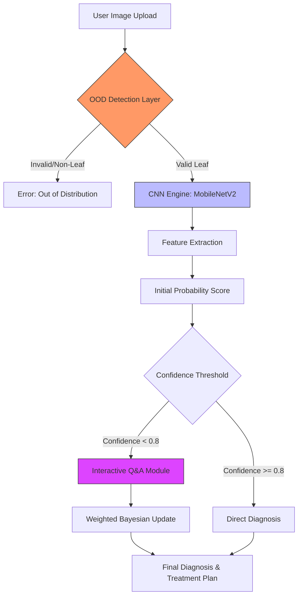

# 🌱 AI Crop Doctor

<p align="center">
  
</p>

---

## 📖 About the Project

**AI Crop Doctor** is an AI-powered web application that helps farmers, gardeners, and agricultural experts **identify plant diseases from leaf images**. By combining **machine learning image analysis** with **context-based follow-up questions**, it delivers **accurate diagnoses** and **practical treatment suggestions**.

### How it works

1. **Upload** an image of your plant or leaf (drag-and-drop or click to select)  
2. **Answer** a few simple questions about symptoms and conditions  
3. **Receive** a confidence-based disease diagnosis and actionable recommendations  

### Key Highlights

- 📸 **AI Image Recognition** for plant disease detection
- 🧭 **Interactive Q\&A** for improved accuracy
- 📊 **Confidence Scores** for transparency
- 📱 **Fully Responsive** and mobile-friendly design
- 🎯 **Actionable Recommendations** to help protect crops

---

## 🧑‍🌾 Step-by-Step Usage Guide

Follow these simple steps to use AI Crop Doctor effectively:

1. Open the AI Crop Doctor web application in your browser.
2. Upload a clear image of the affected plant leaf using drag-and-drop or file selection.
3. Ensure the image is well-lit and focused for accurate analysis.
4. Click on the **Analyze Image** button to start the diagnosis.
5. Answer the follow-up questions related to plant condition and symptoms.
6. Wait a few seconds while the AI processes the image.
7. View the detected disease along with confidence score and treatment recommendations.

---
## System Architecture



---

## 🗂 Project Structure

```text
ai-crop-disease-detection-agent
│
├── docs/                      # New: Technical Documentation
│   ├── MODEL.md               # Model architecture details
│   └── PIPELINE.md            # Q&A Logic flow
│
│ app.py
│ class_indices.json
│ crop_diagnosis_best_model.tflite
│ README.md
│ requirements.txt
│ .gitattributes
│ .gitignore
│
├───static
│ ├───css
│ │ style.css
│ ├───images
│ │ apple_black-rot.JPG
│ │ apple_cedar_rust.JPG
│ │ apple_healthy.JPG
│ │ ... (other sample images)
│ └───js
│ history.js
│ main.js
│ user_guide.js
│
└───templates
history.html
index.html
tools.html
user_guide.html
```

---

## 🛠️ Technical Documentation

To maintain scalability and allow open-source collaboration, we have formalized the project's internal logic. Please refer to the detailed documentation below for a deep dive into the system:

* **[Model Specifications](./docs/MODEL.md)**: Details on CNN architecture (MobileNetV2), input dimensions, training datasets, and model versioning.
* **[Diagnostic Pipeline](./docs/PIPELINE.md)**: Deep dive into the hybrid logic that combines Image Analysis with the Contextual Q&A State Machine.

---

## ⚡ Installation & Setup

1. Clone the repository:
```
git clone https://github.com/your-username/ai-crop-disease-detection-agent.git
cd ai-crop-disease-detection-agent
```
2. Install dependencies:
```
pip install -r requirements.txt
```

3. Run the app:
```
python app.py
```

4. Open your browser and go to: `http://127.0.0.1:5000`

---

## 🤝 Contributing

Contributions are welcome!
1. Fork the repository
2. Create a new branch (`git checkout -b feature-name`)
3. Make your changes
4. Push to your branch (`git push origin feature-name`)
5. Open a Pull Request

---

## 📄 License

This project is [MIT licensed](LICENSE).

<p align="center">  </p> ```

